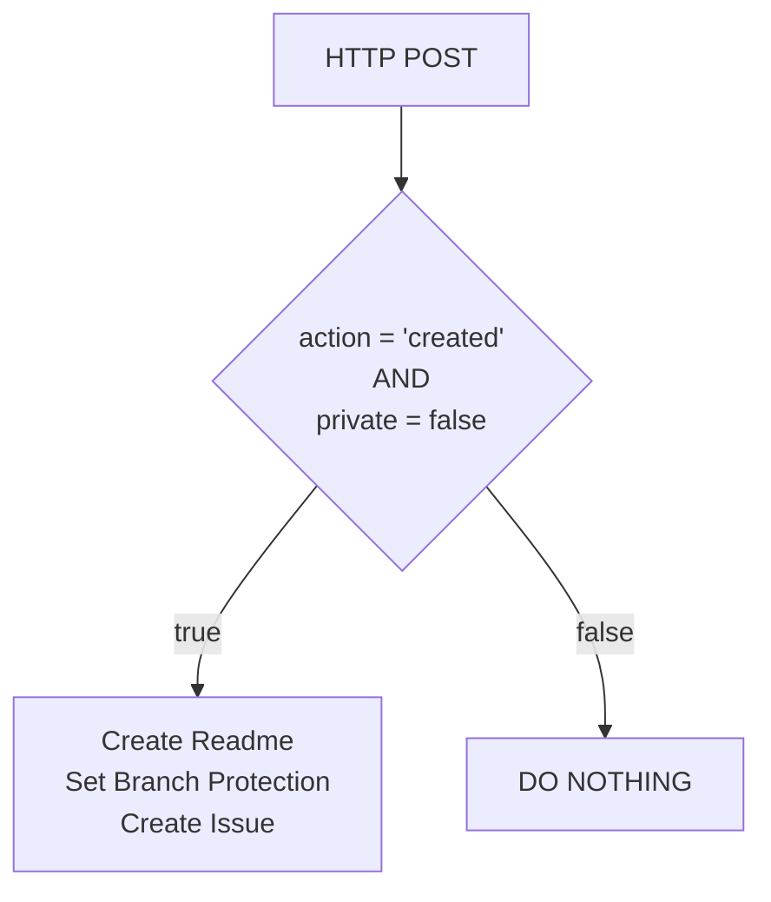

# Guardrails

The purpose of this solution is to implement simple Guardrails to ensure security compliance across the entire GitHub Organization. Whenever a repository is created, a Webhook triggers a [Logic App](https://docs.microsoft.com/en-us/azure/logic-apps/) deployed in Azure.

The Logic App sets up the following through the GitHub REST API:

- Create a Readme file, this creates a new default branch (main)
- Configure branch protection
  - Code reviews must be performed by at least one reviewer before merging code to the main branch
  - Force pushes to the main branch are disabled
  - Conversations/comments must be resolved
- Create an issue in the repository which describes the above settings

The Logic App workflow is illustrated in the diagram below:



The full list of branch protection settings configured are:

```json

{
  "allow_deletions": false,
  "allow_force_pushes": false,
  "enforce_admins": true,
  "required_conversation_resolution": true,
  "required_pull_request_reviews": {
    "dismiss_stale_reviews": true,
    "dismissal_restrictions": {
      "users": [
        "mortenp1337"
      ]
    },
    "require_code_owner_reviews": false,
    "required_approving_review_count": 1
  },
  "required_status_checks": null,
  "restrictions": null
}

```

Details on the branch protection settings can be found [here](https://docs.github.com/en/rest/reference/branches#update-branch-protection).

## Repository structure

Bicep files for deploying the infrastructure to Azure is store in the [.bicep folder](./.bicep)

Github Actions and workflows are in the [.github folder/workflows](./.github/workflows)

When setting this solution up for the first time, instructions are in the [Setup.md file](./setup/Setup.md)

## Prerequisites

### Github and Azure

- A GitHub organization with admin privileges
- A repository for storing the solution
- An Azure subscription with owner permissions
- Access to create service principals in Azure AD

### Local Development

To use this repository you will need the following tools installed:

- GIT
- Azure Bicep
- Azure Powershell modules
- An IDE, ie. Visual Studio Code

## Useful resources

### Microsoft

- [https://docs.microsoft.com/en-us/azure/azure-resource-manager/bicep/key-vault-parameter?tabs=azure-powershell](https://docs.microsoft.com/en-us/azure/azure-resource-manager/bicep/key-vault-parameter?tabs=azure-powershell)
- [https://docs.microsoft.com/en-us/powershell/azure/create-azure-service-principal-azureps?view=azps-7.4.0](https://docs.microsoft.com/en-us/powershell/azure/create-azure-service-principal-azureps?view=azps-7.4.0)

### GitHub

- [https://docs.github.com/en/rest/guides/getting-started-with-the-rest-api](https://docs.github.com/en/rest/guides/getting-started-with-the-rest-api)
- [https://docs.github.com/en/rest/reference/branches](https://docs.github.com/en/rest/reference/branches)
- [https://docs.github.com/en/developers/apps/building-oauth-apps/authorizing-oauth-apps](https://docs.github.com/en/developers/apps/building-oauth-apps/authorizing-oauth-apps)
- [https://docs.github.com/en/rest/reference/issues#create-an-issue](https://docs.github.com/en/rest/reference/issues#create-an-issue)
